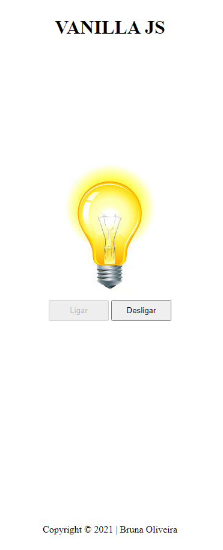

# Lâmpada - DS2M

Projeto criado com objetivo didático para aulas de PWFE do curso Desenvolvimento de Sistemas do [SENAI Jandira](https://jandira.sp.senai.br/), sob orientação do professor [Fernando Leonid](https://github.com/fernandoLeonid).

O projeto consiste em criar uma lâmpada com três ações, ligar, desligar e quebrar, utilizando vários eventos.

O código foi construído pensando em boas práticas, como responsabilidade única e funções puras.

